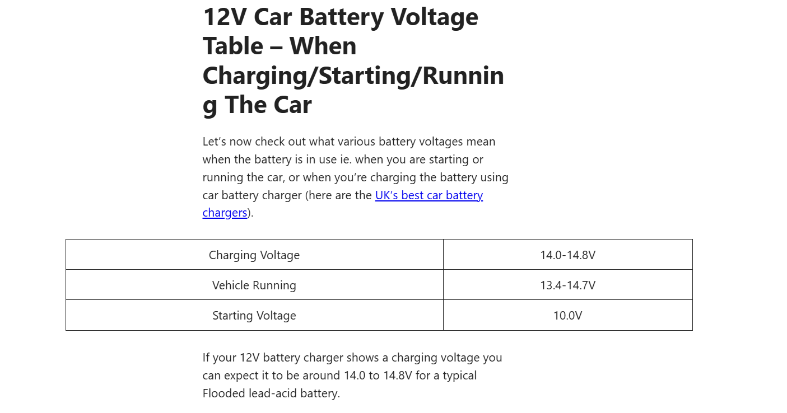

# Tools
1. TinkerCAD
2. Wokwi
3. Micro python

# Software for IoT
Not like in PC, We have to manage,
* Memory -> need to care about data types for each and every value
* IO mounting -> Need to manage ports, configurations, more control we have

BIOS -> Mapping Virtual interface to physical interface on hardware
But in IoT this is not available, we have to handle hardware directly

OS -> We have to manage resources as well in IoT

In IoT -> Basic Runtime Framework -> Just give an envirnment to run
We need to get hardware, drivers and add it by working with more low level languages sometimes

We have to work with device libraries as well and identify the way of their working

## Arduino
* This is develop for Graphic Arts
* So they need to control lighting to setup the artistic envirnment
* So that's why ardunio program = Sketch

## HArdware software interactions
* GPIO - General purpose input output 
* IO signals should be mapped to the corresponding working signal ranges to get the work to be done (conversions, mapping,...)

## need cross-platform development
* In IoT, we don't have screens in most time to debug. Even the program is crashed, the devices(mortors,..) still be in running as it runs before the crash
* debugging - software hardware co debugging
* While monitoring (reading data from the IoT device), the envirnment can be changed, in delay of getting data

## Arduino
* We will get the binary executable which is directly run on the Chip memory

## LUA
* event driven
* can run as a script or convert in to a native byte code

# .NET
* chip > on that > .NET core > on that > Code

# Development Envienment
* Normally compile -> target is own Processor
* But here, compile -> target is the micro controller
* KISS - Keep it simple and stupid , keep it short
 ex - instead of using int array to store 1-100 values, use byte array to reduce storage

## Startup code
* POST - test the sensors,... in correct initial positions to be work properly

## Diagnostic
* Parallel
* Monitoring whats happening in the network, what msgs going in out
* It capture corrupted msgs and log them, sometims take actions
